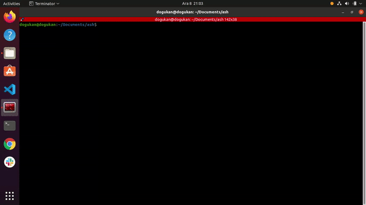

# ash



## Description

ash is a limited implementation of a Unix shell. It is built with C. It is not meant to replace current shells nor is an alternative to current shells. It is built for educational purposes.

## Supported Features

  * Line editting
  * Current logged in user information on each line
  * TAB completion
  * Current working directory information on each line
  * History feature that lets you navigate previous commands

## Future Features
  
  * Piping
  * Input redirection

## Installation

You have two options to install the shell. Either by using Makefile or by install.sh script. Which one you choose is up to you. If you install using install.sh script, you can run the ash command in every directory without specifying the whole path. However, you must have root privileges in order to run it because the script places the shell script in `/usr/bin/local`. You can do the following for installing with script:

```
git clone https://github.com/dogukanteber/ash.git && cd ash
```

```
chmod +x install.sh
```

```
./install.sh && ash
```

If you would like to remove the shell from binaries you can run the `remove.sh` script with root privileges and it will be removed from your system.

You can do the following for installing with Makefile:

```
git clone https://github.com/dogukanteber/ash.git && cd ash
```

```
make && ./ash
```


## Contribution

I would be appreciated if you improve the project by adding pipes and stuff. Or, you may find memory leaks or nasty bugs that may cause a big problem. If you do so, go ahead and create a PR. There is no limit to this project. It can be improved as much as we can.

## Credit

I have started to build this project with the help of [Stephan Brennan](https://github.com/brenns10)'s blog about Linux shells. You can check out the blog from [here](https://brennan.io/2015/01/16/write-a-shell-in-c/). Credit goes to him for creating such a great content.

